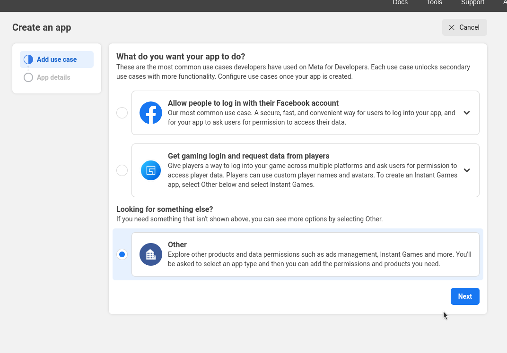
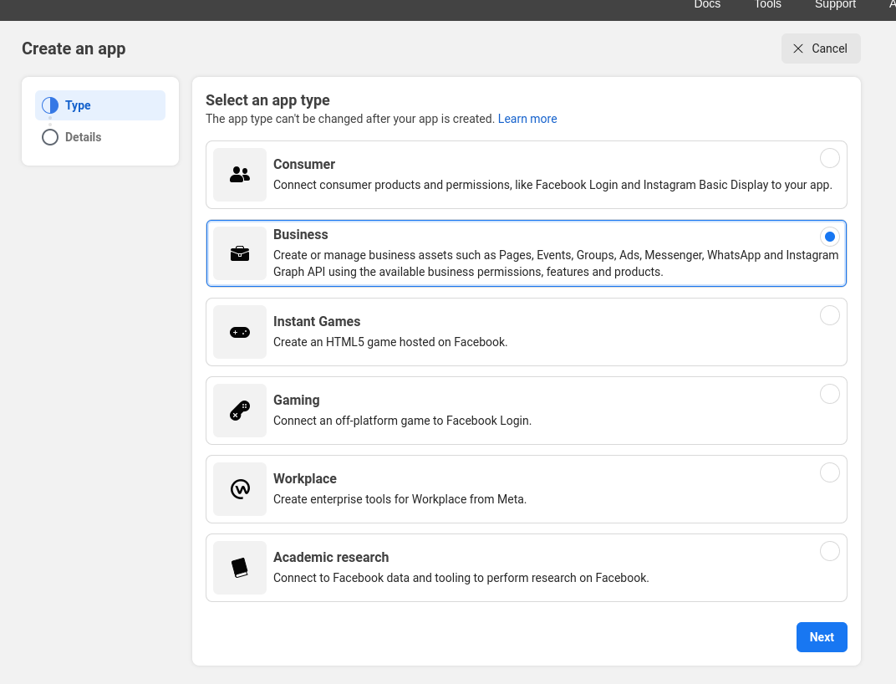
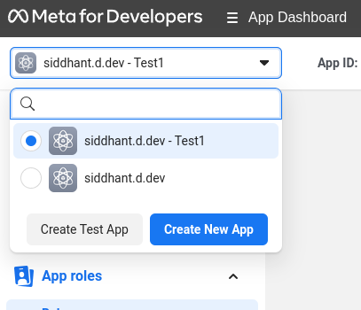
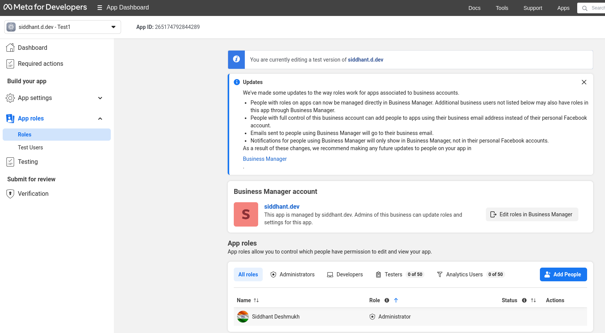
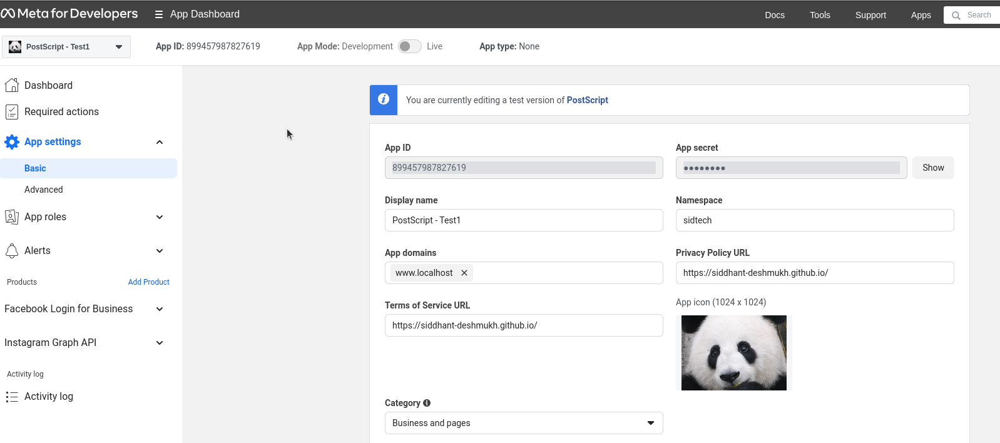
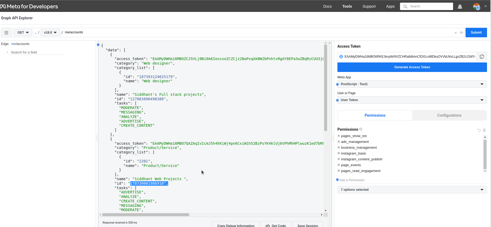
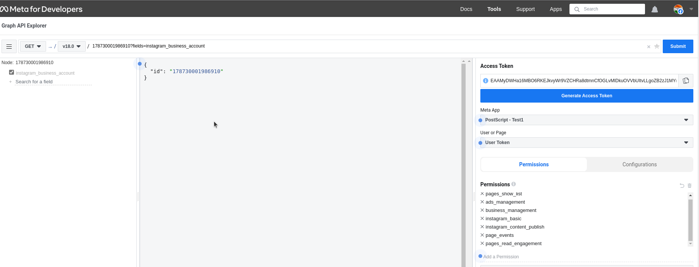

- [Getting Long Live token](#getting-long-live-token)
- [Instagram Graph Api setup](#instagram-graph-api-setup)
- [File Structure](#file-structure)
- [Python Script](#python-script)

# Getting Long Live token

* [User access tokens come in two forms](https://developers.facebook.com/docs/facebook-login/guides/access-tokens/#termtokens): 
  * short-lived tokens and long-lived tokens. 
  * Short-lived tokens usually have a lifetime of about an **hour or two**
  * long-lived tokens usually have a lifetime of about **60 days**.
* ## Getting the short lived access token:
  * Go to **https://developers.facebook.com/tools/explorer**
  * Choose from the **Meta app** ( should be test for posting instagram ) 
  * Select **User Token** and permission needed ( just to get long lived token no specific permissions are needed but for other things you need so select the permissions)
  * Generate the access token
* ## Converting short lived to long lived:
  * Paste the short lived access token in `token.txt`
  * and run `python getLongLivedToken.py`
  * It will save the long lived token in `token.txt`

# Instagram Graph Api setup
* The Instagram Graph API is a collection of Facebook Graph API endpoints that allow apps to access data in Instagram Professional accounts (both Business and Creator accounts).
* Things needed
  * Upgrade the existing instagram account to buisness/creator. https://help.instagram.com/502981923235522/?cms_platform=android-app&helpref=platform_switcher
  * If you don't have create a new facebook page https://www.facebook.com/business/help/473994396650734?id=939256796236247
  * Connect instagram account to facebook page https://help.instagram.com/570895513091465
  * Must have a facebook account. (Lets call it FAccount)
  * FAccount must have Task Access to that page https://www.facebook.com/help/187316341316631
  * [Create facebook app.](https://developers.facebook.com/docs/development/create-an-app/) We need Instagram Graph API so select **Buisness** as app type.
  *  While creating the app choose
     * 
     * 
     * From the add products add **Facebook Login for Business** and Instagram Graph API
  * Also create the test-app for the same app and configure the basic settings.
  * 
  * Create a Test App Like this  
  * This is because [Permissions](https://developers.facebook.com/docs/graph-api/guides/explorer/#permissions)
    ```
    Permissions
      * Whenever you request a User access token, only one permission is given by default, public_profile. The Permission dropdown menu allows you to select User Data Permissions, such as email and user_photos, Events, Groups, and Pages Permissions, such as manage_pages and ads_management, and Other permissions, such as instagram_basic and publish_video permissions. This allows the current app User (which is you) to grant the app specific permissions. Only grant permissions that your app actually needs.

      * If your app is in development, you can grant your app any permission and your queries respect them for data owned by people with a role on your app. If your app is live, however, granting a permission that your app has not been approved for by the App Review process causes your query to fail whenever you submit it.
    ```
    * Bascially, you will need to ask for permission for normal app but for test app you will get all permission for the user having roles in app.
  * FAccount should have a role in that test_app. 

# File Structure

1. To get access token go to the tool https://developers.facebook.com/tools/explorer
   1. choose the **test app** and **User Token** and permissions as shown in image
   2.  
   3. [Required permission for Content Publishing](https://developers.facebook.com/docs/instagram-api/guides/content-publishing/#permissions):
      * ads_management
      * business_management
      * instagram_basic
      * instagram_content_publish
      * pages_read_engagement 
      * Also add just for safety
        * pages_show_list
        * page_events
   4. Copy the token
2. Create a token.txt in the root directory and add the access token in it.
3. Get the APP_ID and APP_SECRET from the App Settings Basic section
   1. 
4. Get IG_USER_ID from 
   1. follow https://developers.facebook.com/docs/instagram-api/getting-started#4--get-the-user-s-pages
      1. Run the URL as shown and select the id of the page which is connected to the instagram
      2. 
   2. and https://developers.facebook.com/docs/instagram-api/getting-started#5--get-the-page-s-instagram-business-account
      1. Run the url and you will get the instagram account id
      2. 
5. Create .env file and add the 
   ```
   APP_ID=""
   APP_SECRET=""
   IG_USER_ID=""
   ```
6. 

# Python Script

* Installing required libraries
  ```
  pip install python-dotenv
  ```
* The copy link we get from drive can not be use so have to do [this modification](https://support.exclaimer.com/hc/en-gb/articles/4445816657309-How-to-host-images-using-Google-Drive)
  * I have already added this part in the script
  * You can directly copy paste the Drive url.
